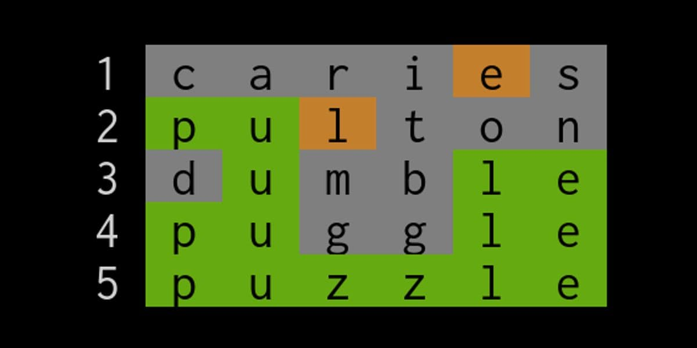

wordpy
======



Word puzzle solver.


## Use as solver

``` shell
$ git clone https://github.com/macrat/wordpy.git
$ python3.10 -m wordpy
candidates 0:               
cares
cores
bares
carey
bores
canes
carts
ceras
cires
corey

what did you input?
  _____
> cares
what was correct? (input incorrect character as .)
  _____
> ..r..
what characters was yellow?
> a
```

`what did you input?` -> enter what you have input to the game.

`what was correct?` -> enter what letters was correct. please input incorrect letters as `.`.

`what characters was yellow?` -> enter what letters was included in the answer but not correct position.


## Make your own solver

``` python
import wordpy


class MySolver(wordpy.Solver):
    def __init__(self, game: wordpy.Game):
        super().__init__(game)

        # do initialization here

    def guess(self) -> wordpy.WordTable:
        self.state # current game status.
        self.words # current word candidates.

        self.drop_words_by_state() # drop words that can't be the answer, from self.words.

        return self.words[:10] # return some next word candidates.


words = wordpy.get_words()
average_attempts, average_wins = wordpy.benchmark(words, MySolver)

print(f'average {average_attempts} attempts, {average_wins:.0%} wins')
```
